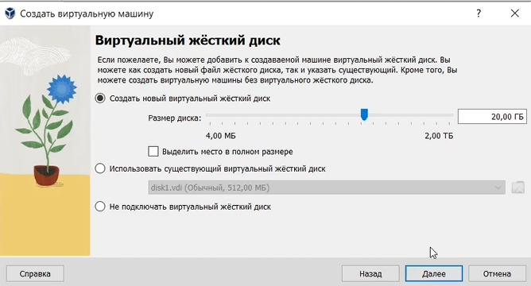
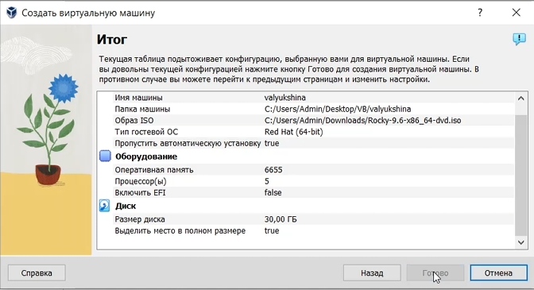
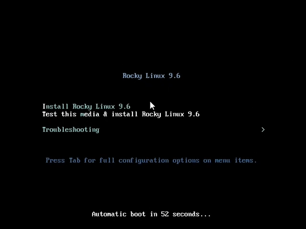
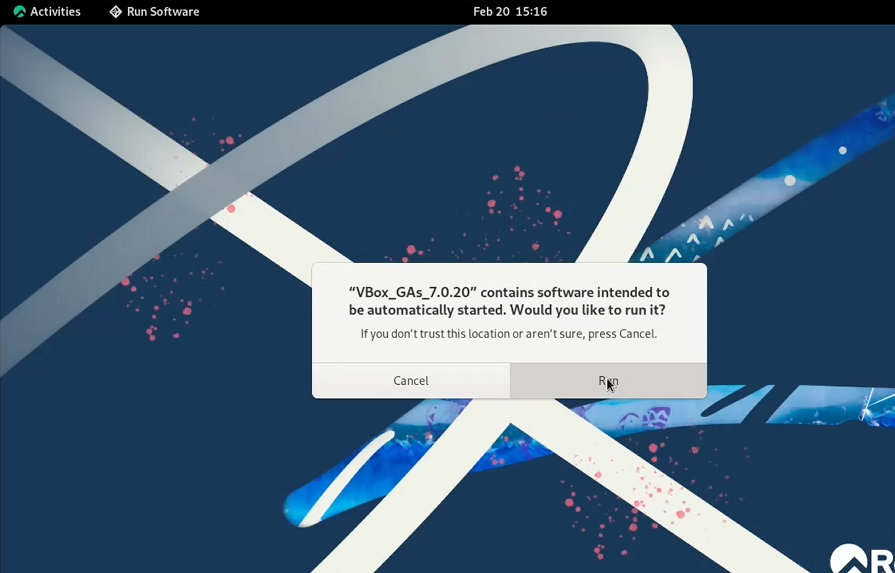
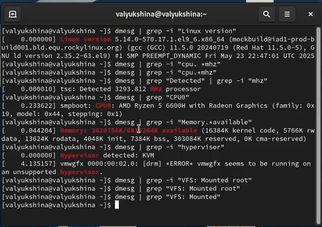

---
## Author
author:
  name: Люкшина Влада Алексеевна
  degrees: DSc
  orcid: 0000-0002-0877-7063
  email: kulyabov-ds@rudn.ru
  affiliation:
    - name: Российский университет дружбы народов
      country: Российская Федерация
      postal-code: 117198
      city: Москва
      address: ул. Миклухо-Маклая, д. 6

## Title
title: "Лабораторная работа №1"
subtitle: "Установка и конфигурация операционной системы на виртуальную машину"
---

# Цель работы

Целью данной работы является приобретение практических навыков установки операционной системы на виртуальную машину, настройки минимально необходимых для дальнейшей работы сервисов.

# Задание
 Установить дистрибутив OC Rocky и настроить его.

# Выполнение лабораторной работы
Создадим новую виртуальную машину. Для этого в VirtualBox выберем Машина → Создать. Укажем имя виртуальной машины и выберем образ Rocky Linux.

Укажем размер основной памяти виртуальной машины и процессоры.

Зададим конфигурацию жёсткого диска: загрузочный, VDI (VirtualBox Disk Image), динамический виртуальный диск. Зададим размер диска — 30 ГБ, его расположение — в данном случае /var/tmp/имя_пользователя/имя_пользователя.vdi.

Создадим виртуальную машину.

Запустим виртуальную машину.

Выберем English в качестве языка интерфейса и перейдём к настройкам установки операционной системы. Скорректируем часовой пояс, раскладку клавиатуры (рекомендуется добавить русский язык, но в качестве языка по умолчанию укажем английский; зададим комбинацию клавиш для переключения между раскладками клавиатуры — например Alt + Shift).

В разделе выбора программ укажем в качестве базового окружения Server with GUI, а в качестве дополнения — Development Tools. Отключим KDUMP. Место установки ОС оставим без изменения.

Включим сетевое соединение и в качестве имени узла укажем valyukshina.localdomain. Установим пароль для root и пользователя с правами администратора.

После завершения установки операционной системы корректно перезапустим виртуальную машину и при запросе примем условия лицензии. Войдём в ОС под своей учётной записью.

В меню Устройства виртуальной машины подключим образ диска дополнений гостевой ОС.

После загрузки дополнений нажмём Return или Enter и корректно перезагрузим виртуальную машину.

# Домашнее задание
Дождемся загрузки графического окружения и откроем терминал. В окне терминала проанализируем последовательность загрузки системы, выполнив команду dmesg. 
Получим следующую информацию.
1. Версия ядра Linux (Linux version)
2. Частота процессора (Detected Mhz processor).
3. Модель процессора (CPU0).
4. Объем доступной оперативной памяти (Memory available).
5. Тип обнаруженного гипервизора (Hypervisor detected).
6. Тип файловой системы корневого раздела.
7. Последовательность монтирования файловых систем.

