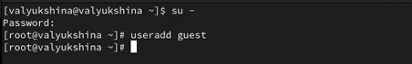
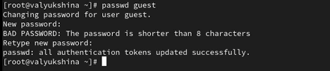
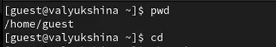
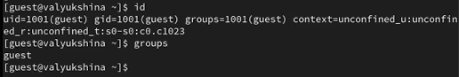
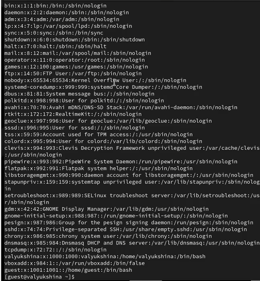
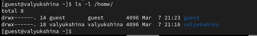
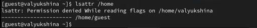
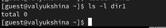
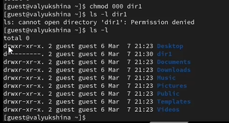
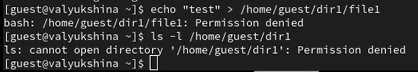

---
## Author
author:
  name: Люкшина Влада Алексеевна
  degrees: студент
  orcid: 0000-0002-0877-7063
  email: 1132243022@rudn.ru
  affiliation:
    - name: Российский университет дружбы народов
      country: Российская Федерация
      postal-code: 117198
      city: Москва
      address: ул. Миклухо-Маклая, д. 6

## Title
title: "Лабораторная работа № 2"
subtitle: "Дискреционное разграничение прав в Linux. Основные атрибуты"
license: "CC BY"
---

# Цель работы

Получение практических навыков работы в консоли с атрибутами файлов, закрепление теоретических основ дискреционного разграничения доступа в современных системах с открытым кодом на базе ОС Linux1.

# Задание

Выполнить задания из лабораторной работы и отразить результаты в таблице в отчете.

# Выполнение лабораторной работы

В установленной при выполнении предыдущей лабораторной работы операционной системе создадим учётную запись пользователя guest, используя учётную запись администратора([рис. @fig-001]).

{#fig-001 width=70%}

Зададим пароль для пользователя guest, используя учётную запись администратора([рис. @fig-002]).

{#fig-002 width=70%}

Войдём в систему от имени пользователя guest. Определим директорию, в которой находимся. Сравним её с приглашением командной строки. Определим, является ли она нашей домашней директорией([рис. @fig-003]).

{#fig-003 width=70%}

Уточним имя нашего пользователя([рис. @fig-004]).

{#fig-004 width=70%}

Уточним имя нашего пользователя, его группу, а также группы, куда входит пользователь. Запомним выведенные значения uid, gid и др. Сравним этот вывод с выводом команды groups.Сравним полученную информацию об имени пользователя с данными, выводимыми в приглашении командной строки([рис. @fig-005]).

{#fig-005 width=70%}

Просмотрим файл /etc/passwd. Найдём в нём свою учётную запись. Определим uid и gid пользователя. Сравним найденные значения с полученными ранее([рис. @fig-006]).

{#fig-006 width=70%}

Определим существующие в системе директории в /home/. Проверим, удалось ли получить список поддиректорий. Выясним, какие права установлены на этих директориях([рис. @fig-007]).

{#fig-007 width=70%}

Проверим, какие расширенные атрибуты установлены на поддиректориях в /home/. Убедимся, удалось ли увидеть расширенные атрибуты своей директории и директорий других пользователей([рис. @fig-008]).

{#fig-008 width=70%}

Создадим в домашней директории поддиректорию dir1. Определим, какие права доступа и расширенные атрибуты были выставлены на эту директорию.([рис. @fig-009]).

{#fig-009 width=70%}

Снимем с директории dir1 все атрибуты и проверим правильность выполнения([рис. @fig-010]).

{#fig-010 width=70%}

Попытаемся создать в директории dir1 файл file1. Нам отказано, так как недостаточно прав. Проверим, действительно ли файл file1 не находится внутри директории dir1([рис. @fig-011]).

{#fig-011 width=70%}

Заполним таблицу «Установленные права и разрешённые действия», выполняя действия от имени владельца директории (файлов). Определим опытным путём, какие операции разрешены, а какие нет. Если операция разрешена, поставим в таблице знак «+», если не разрешена — знак «-».

: Установленные права и разрешенные действия

|Права директории|Права файла|1|2|3|4|5|6|7|8|
|:---|:---|---|---|---|---|---|---|---|---|
|d---------(000)|----------(000)|-|-|-|-|-|-|-|-|
|d--x------(100)|----------(000)|-|-|-|-|+|-|-|+|
|d-w-------(200)|----------(000)|-|-|-|-|-|-|-|-|
|d-wx------(300)|----------(000)|+|+|-|-|+|-|+|+|
|dr--------(400)|----------(000)|-|-|-|-|-|-|-|-|
|dr-x------(500)|----------(000)|-|-|-|-|+|+|-|+|
|drw-------(600)|----------(000)|-|-|-|-|-|-|-|-|
|drwx------(700)|----------(000)|+|+|-|-|+|+|+|+|

Пояснения к таблице:
1 - Создание файла

2 - Удаление файла

3 - Запись в файл

4 - Чтение файла

5 - Смена директории

6 - Просмотр файлов в директории

7 - Переименование файла

8 - Смена атрибутов файла

На основании таблицы выше определи минимально необходимые права для выполнения операций внутри директории dir1 и заполнили таблицу. Последние два пункта проверим опытным путем.

: Минимальные права для совершения операций

|Операция|Права на директорию|Права на файл|
|:---:|:---:|:---:|
|Создание файла|d-wx------ (300)|---------- (000)|      
|Удаление файла|d-wx------ (300)|---------- (000)|
|Чтение файла|d--x------ (100)|-r-------- (400)|
|Запись в файл|d--x------ (100)|--w------- (200)|
|Переименование файла|d-wx------ (300)|----------(000)|
|Создание поддиректории|d-wx------ (300)|---------- (000)|
|Удаление поддиректории|d-wx------ (300)|---------- (000)|

# Выводы

В ходе выполнения лабораторной работы №2 мы научились управлять правами доступа и выяснили различия между ними.

::: {#refs}
:::
