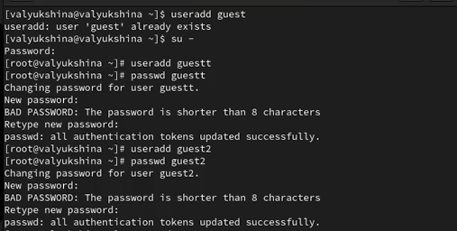
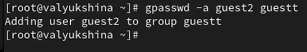
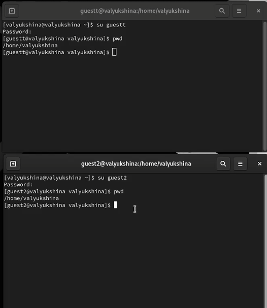
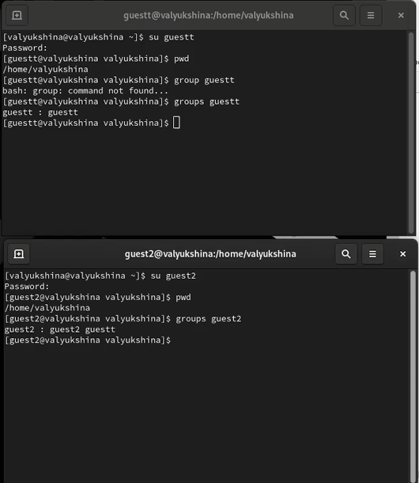
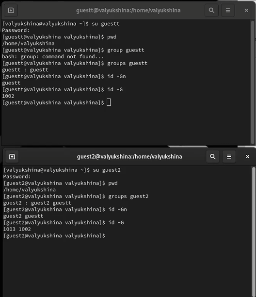
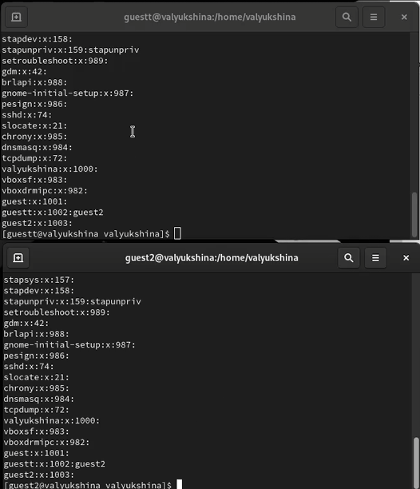
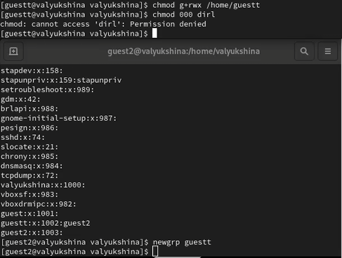

---
## Author
author:
  name: Люкшина Влада Алексеевна
  degrees: student
  orcid: 0000-0002-0877-7063
  email: 1132243022@rudn.ru
  affiliation:
    - name: Российский университет дружбы народов
      country: Российская Федерация
      postal-code: 117198
      city: Москва
      address: ул. Миклухо-Маклая, д. 6
## Title
title: Лабораторная работа № 3
subtitle: Дискреционное разграничение прав в Linux.
license: CC BY
date: today
date-format: "YYYY-MM-DD" # Example: 2025-09-06
---

# Информация

## Докладчик

:::::::::::::: {.columns align=center}
::: {.column width="70%"}

  * Люкшина Влада Алексеевна
  * студент 2 курса
  * Российский университет дружбы народов им. П. Лумумбы

:::
::::::::::::::

# Цель работы
## Цель работы

- Получение практических навыков работы в консоли с атрибутами файлов для групп пользователей.

# Задание
## Задание

- Выполнить задания из лабораторной работы и отразить результаты в таблице в отчете.

# Выполнение лабораторной работы
## Пользователи

- В установленной операционной системе создадим учётную запись пользователя guest, используя учётную запись администратора.Зададим пароль для пользователя guest, используя учётную запись администратора.Аналогично создадим второго пользователя guest2.([рис. @fig-001])

{#fig-001 width=70%}

## Добавление

- Добавим пользователя guest2 в группу guest.([рис. @fig-002])

{#fig-002 width=70%}

## Вход

- Осуществим вход в систему от двух пользователей на двух разных консолях: guest на первой консоли и guest2 на второй консоли. Для обоих пользователей определим командой pwd директорию, в которой мы находимся. Сравним её с приглашениями командной строки. Как мы видим, директории одинаковые. ([рис. @fig-003])

{#fig-003 width=70%}

## Группы и айди

- Уточним имя нашего пользователя, его группу, кто входит в неё, и к каким группам принадлежит он сам. Определим командами groups guest и groups guest2, в какие группы входят пользователи guest и guest2.([рис. @fig-004])

{#fig-004 width=70%}

## Группы и айди

- Сравним вывод команды groups с выводом команд id -Gn и id -G. Команды выводят имя групп, в которых состоит пользователь, и их айди соотвественно.([рис. @fig-005])

{#fig-005 width=70%}

## Группы и айди

- Сравним полученную информацию с содержимым файла /etc/group. Просмотрим файл. В файле так же указаны группы и их айди. ([рис. @fig-006])

{#fig-006 width=70%}

## Смена атрибутов

- От имени пользователя guest2 выполним регистрацию пользователя guest2 в группе guest. От имени пользователя guest изменим права директории /home/guest, разрешив все действия для пользователей группы. От имени пользователя guest снимем с директории /home/guest/dir1 все атрибуты и проверим правильность снятия атрибутов.([рис. @fig-007])

{#fig-007 width=70%}

## Таблица
Меняя атрибуты у директории dir1 и файла file1 от имени пользователя guest и делая проверку от пользователя guest2, заполним табл. 3.1, определив опытным путём, какие операции разрешены, а какие нет. Если операция разрешена, занесём в таблицу знак «+», если не разрешена — знак «-».

## Таблица 3.1

: Таблица 3.1. Установленные права и разрешённые действия для групп

| Права директории | Права файла | 1 | 2 | 3 | 4 | 5 | 6 | 7 | 8 |
|------------------|-------------|---|---|---|---|---|---|---|---|
| `d---------` (000) | `----------` (000) | - | - | - | - | - | - | - | - |
| `d--x------` (010) | `----------` (000) | - | - | - | - | + | - | - | - |
| `d--x------` (010) | `--w-------` (020) | - | - | - | - | + | - | - | - |
| `d--x------` (010) | `---x------` (010) | - | - | - | - | + | - | - | - |
| `d--x------` (010) | `-rw-------` (060) | - | - | - | - | + | - | - | - |
| `d--x------` (010) | `-rwx------` (070) | - | - | - | - | + | - | - | - |
| `d-w-------` (020) | `----------` (000) | - | - | - | - | - | - | - | - |
| `d-w-------` (020) | `--w-------` (020) | - | - | - | - | - | - | - | - |
| `d-w-------` (020) | `---x------` (010) | - | - | - | - | - | - | - | - |
| `d-w-------` (020) | `-rw-------` (060) | - | - | - | - | - | - | - | - |

## Таблица 3.1

| `d-wx------` (030) | `----------` (000) | - | - | - | - | + | - | - | - |
| `d-wx------` (030) | `--w-------` (020) | - | - | - | - | + | - | - | - |
| `d-wx------` (030) | `---x------` (010) | - | - | - | - | + | - | - | - |
| `d-wx------` (030) | `-rw-------` (060) | - | - | - | - | + | - | - | - |
| `dr--------` (040) | `----------` (000) | - | - | - | - | - | + | - | - |
| `dr--------` (040) | `--w-------` (020) | - | - | - | - | - | + | - | - |
| `dr--------` (040) | `---x------` (010) | - | - | - | - | - | + | - | - |
| `dr--------` (040) | `-rw-------` (060) | - | - | - | - | - | + | - | - |

## Таблица 3.1

| `dr-x------` (050) | `----------` (000) | - | - | - | - | + | + | - | - |
| `dr-x------` (050) | `--w-------` (020) | - | - | - | - | + | + | - | - |
| `dr-x------` (050) | `---x------` (010) | - | - | - | - | + | + | - | - |
| `dr-x------` (050) | `-rw-------` (060) | - | - | - | + | + | + | - | - |
| `dr-x------` (050) | `-rwx------` (070) | - | - | + | + | + | + | - | - |
| `drw-------` (060) | `----------` (000) | - | - | - | - | - | + | - | - |
| `drw-------` (060) | `--w-------` (020) | - | - | - | - | - | + | - | - |
| `drw-------` (060) | `---x------` (010) | - | - | - | - | - | + | - | - |
| `drw-------` (060) | `-rw-------` (060) | - | - | - | - | - | + | - | - |

## Таблица 3.1

| `drwx------` (070) | `----------` (000) | + | + | - | - | + | + | + | - |
| `drwx------` (070) | `--w-------` (020) | + | + | - | - | + | + | + | - |
| `drwx------` (070) | `---x------` (010) | + | + | - | - | + | + | + | - |
| `drwx------` (070) | `-rw-------` (060) | + | + | + | + | + | + | + | - |
| `drwx------` (070) | `-rwx------` (070) | + | + | + | + | + | + | + | - |
| `drwxrwx---` (770) | `-rw-rw----` (660) | + | + | + | + | + | + | + | - |

## Таблица 3.1

Пояснения:
Создание - 1 
Удаление - 2
Запись - 3
Чтение - 4
Смена директории - 5
Просмотр файлов - 6
Переименование - 7
Смена атрибутов - 8 

## Таблица 3.2

- Сравним табл. 2.1 (из лабораторной работы № 2) и табл. 3.1. На основании заполненной таблицы определим те или иные минимально необходимые права для выполнения пользователем guest2 операций внутри директории dir1 и заполним табл. 3.2.

## Таблица 3.2

: Таблица 3.2. Минимальные права для совершения операций от имени пользователей, входящих в группу

| Операция | Минимальные права на директорию | Минимальные права на файл |
|----------|--------------------------------|--------------------------|
| Создание файла | `d-wx------` (030) | Не требуется |
| Удаление файла | `d-wx------` (030) | Не требуется |
| Чтение файла | `d--x------` (010) | `-r--------` (040) |
| Запись в файл | `d--x------` (010) | `--w-------` (020) |
| Переименование файла | `d-wx------` (030) | Не требуется |
| Создание поддиректории | `d-wx------` (030) | Не требуется |
| Удаление поддиректории | `d-wx------` (030) | Не требуется |

# Выводы

- В ходе выполнения лабораторной работы №3 мы научились управлять правами доступа и выяснили различия между ними.

