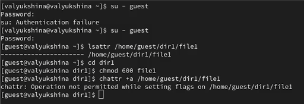
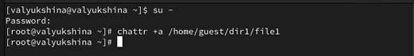
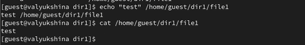
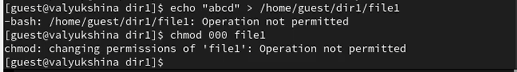
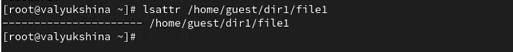
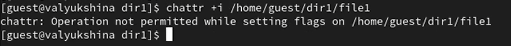
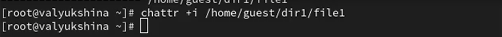
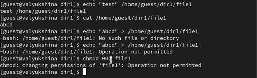

---
## Author
author:
  name: Люкшина Влада Алексеевна
  degrees: студент
  orcid: 0000-0002-0877-7063
  email: 1132243022@rudn.ru
  affiliation:
    - name: Российский университет дружбы народов
      country: Российская Федерация
      postal-code: 117198
      city: Москва
      address: ул. Миклухо-Маклая, д. 6

## Title
title: "Лабораторная работа № 4"
subtitle: "Дискреционное разграничение прав в Linux. Расширенные атрибуты"
license: "CC BY"
---

# Цель работы

Получение практических навыков работы в консоли с расширенными атрибутами файлов.

# Задание

Попробовать выполнение команд с разными расширенными атрибутами.

# Выполнение лабораторной работы

Определим от имени пользователя guest расширенные атрибуты файла /home/guest/dir1/file1 командой lsattr /home/guest/dir1/file1. Установим командой chmod 600 file1 на файл file1 права, разрешающие чтение и запись для владельца файла. Попробуем установить на файл /home/guest/dir1/file1 расширенный атрибут a от имени пользователя guest: chattr +a /home/guest/dir1/file1. В ответ получим отказ от выполнения операции.([рис. @fig-001])

{#fig-001 width=70%}

Зайдём на вторую консоль с правами администратора. Попробуем установить расширенный атрибут a на файл /home/guest/dir1/file1 от имени суперпользователя: chattr +a /home/guest/dir1/file1. ([рис. @fig-002])

{#fig-002 width=70%}

От пользователя guest проверим правильность установления атрибута: lsattr /home/guest/dir1/file1.([рис. @fig-003])

{#fig-003 width=70%}

Выполним дозапись в файл file1 слова «test» командой echo "test" >> /home/guest/dir1/file1. После этого выполним чтение файла file1 командой cat /home/guest/dir1/file1. Убедимся, что слово test было успешно записано в file1.([рис. @fig-004])

{#fig-004 width=70%}

Попробуем удалить файл file1 либо стереть имеющуюся в нём информацию командой echo "abcd" > /home/guest/dir1/file1. Попробуем переименовать файл. Попробуем с помощью команды chmod 000 file1 установить на файл file1 права, запрещающие чтение и запись для владельца файла. Обе команды не удалось выполнить, видим отказ в доступе. ([рис. @fig-005])

{#fig-005 width=70%}

Снимем расширенный атрибут a с файла /home/guest/dir1/file1 от имени суперпользователя командой chattr -a /home/guest/dir1/file1.([рис. @fig-006])

{#fig-006 width=70%}

Повторим операции, которые нам ранее не удавалось выполнить. Как мы видим, в этот раз нам удалось перезаписать файл и изменить права доступа от имени пользователя guest.([рис. @fig-007])

{#fig-007 width=70%}

Повторим наши действия по шагам, заменив атрибут «a» атрибутом «i». Проверим расширенные атрибуты файла1, пока что они отсутсвуют.([рис. @fig-008])

{#fig-008 width=70%}

Попробуем установить расширенный атрибут i от имени пользователя guest. Нам отказано в доступе, как и при попытке установить атрибут a.([рис. @fig-009])

{#fig-009 width=70%}

Установим расширенный атрибут i от имени суперпользователя.([рис. @fig-010])

{#fig-010 width=70%}

Проверим успешность установки атрибута.([рис. @fig-011])

{#fig-011 width=70%}

Попробуем повторить все операции. Не удалось выполнить ни одну операцию кроме чтения файла1.([рис. @fig-012])

{#fig-012 width=70%}

# Выводы

В ходе выполнения лабораторной работы №4 мы повысили свои навыки использования интерфейса командой строки (CLI), познакомились на примерах с тем, как используются основные и расширенные атрибуты при разграничении
доступа. Имели возможность связать теорию дискреционного разделения доступа (дискреционная политика безопасности) с её реализацией на практике в ОС Linux. Составили наглядные таблицы, поясняющие какие операции возможны при тех или иных установленных правах. Опробовали действие на практике расширенных атрибутов «а» и «i»

::: {#refs}
:::
