---
## Author
author:
  name: Люкшина Влада Алексеевна
  degrees: студент
  orcid: 0000-0002-0877-7063
  email: 1132243022@rudn.ru
  affiliation:
    - name: Российский университет дружбы народов
      country: Российская Федерация
      postal-code: 117198
      city: Москва
      address: ул. Миклухо-Маклая, д. 6

## Title
title: "Лабораторная работа № 5"
subtitle: "Исследование влияния дополнительных атрибутов"
license: "CC BY"
---

# Цель работы

Изучение механизмов изменения идентификаторов, применения SetUID- и Sticky-битов. Получение практических навыков работы в консоли с дополнительными атрибутами. Рассмотрение работы механизма смены идентификатора процессов пользователей, а также влияние бита Sticky на запись и удаление файлов.

# Задание

Выполнить задания из лабораторной работы и отразить результаты в отчете.

# Выполнение лабораторной работы

Войдём в систему от имени пользователя guest.

Создадим программу simpleid.c с следующим содержанием (функции для получения эффективных идентификаторов пользователя и группы, вывод их на экран).([рис. @fig-001])

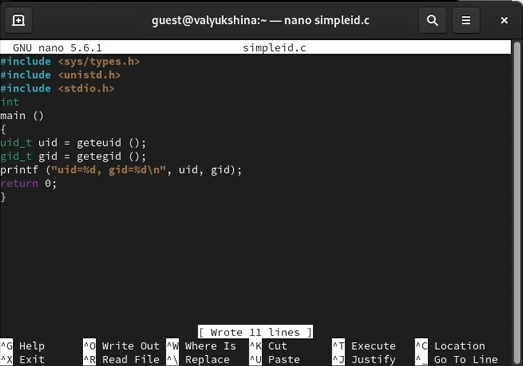{#fig-001 width=70%}

Скомпилируем программу и убедимся, что файл программы создан. Выполним программу simpleid. Выполним системную программу id и сравним полученный результат с данными предыдущего пункта задания.([рис. @fig-002])

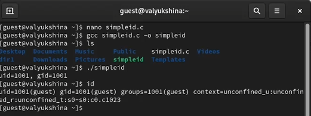{#fig-002 width=70%}

Усложним программу, добавив вывод действительных идентификаторов. Получившуюся программу назовём simpleid2.c.([рис. @fig-003])

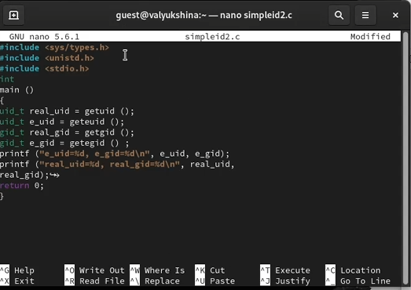{#fig-003 width=70%}

Скомпилируем и запустим simpleid2.c. От имени суперпользователя выполним команды для смены владельца файла на root:guest и установки SetUID-бита. Используем sudo или повысим временно свои права с помощью su. Выполним проверку правильности установки новых атрибутов и смены владельца файла simpleid2. ([рис. @fig-004])

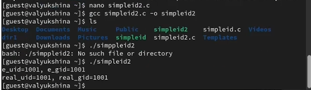{#fig-004 width=70%}

Запустим simpleid2 и id. Сравним результаты. Проделаем то же самое относительно SetGID-бита.([рис. @fig-005])

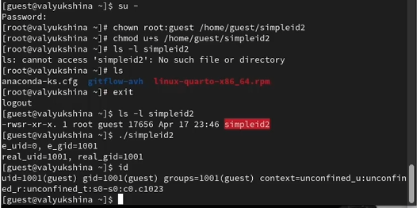{#fig-005 width=70%}

Создадим программу readfile.c с следующим содержанием (открытие файла, переданного в аргументе, чтение блоками по 16 байт и вывод содержимого на экран).([рис. @fig-006])

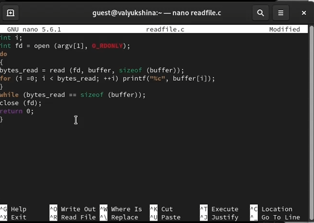{#fig-006 width=70%}

Откомпилируем её.([рис. @fig-007])

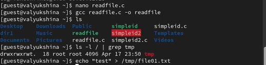{#fig-007 width=70%}

Исследование Sticky-бита: Выясним, установлен ли атрибут Sticky на директории /tmp, для чего выполним команду просмотра атрибутов корневого каталога с фильтрацией по tmp. От имени пользователя guest создадим файл file01.txt в директории /tmp со словом test. Просмотрим атрибуты у только что созданного файла и разрешим чтение и запись для категории пользователей «все остальные».([рис. @fig-008])

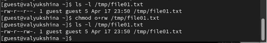{#fig-008 width=70%}

От пользователя guest2 (не являющегося владельцем) попробуем прочитать файл /tmp/file01.txt. От пользователя guest2 попробуем дозаписать в файл /tmp/file01.txt слово test2. Проверим содержимое файла. От пользователя guest2 попробуем записать в файл /tmp/file01.txt слово test3, стерев при этом всю имеющуюся в файле информацию. Проверим содержимое файла. Все операции успешно выполнились. От пользователя guest2 попробуем удалить файл /tmp/file01.txt. Нам не удалось удалить файл. ([рис. @fig-009])

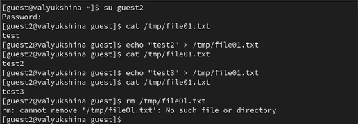{#fig-009 width=70%}

Повысим свои права до суперпользователя и выполним после этого команду, снимающую атрибут t (Sticky-бит) с директории /tmp. Покинем режим суперпользователя. От пользователя guest2 проверим, что атрибута t у директории /tmp нет. ([рис. @fig-010])

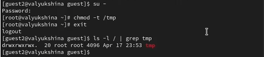{#fig-010 width=70%}

Повысим свои права до суперпользователя и вернём атрибут t на директорию /tmp.([рис. @fig-011])

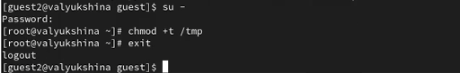{#fig-011 width=70%}

# Выводы

В ходе выполнения лабораторной работы №5 мы поработали с атрибутами от имени разных пользователей.

::: {#refs}
:::
