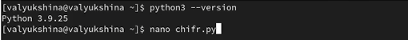
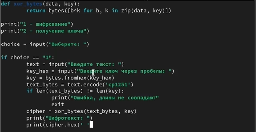
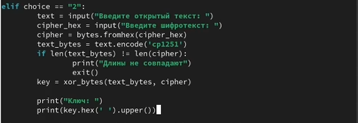
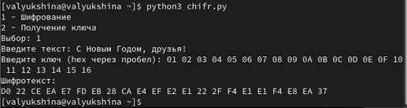
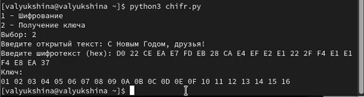

---
## Author
author:
  name: Люкшина Влада Алексеевна
  degrees: student
  orcid: 0000-0002-0877-7063
  email: 1132243022@rudn.ru
  affiliation:
    - name: Российский университет дружбы народов
      country: Российская Федерация
      postal-code: 117198
      city: Москва
      address: ул. Миклухо-Маклая, д. 6
## Title
title: Лабораторная работа № 7
subtitle: Элементы криптографии. Однократное гаммирование
license: CC BY
date: today
date-format: "YYYY-MM-DD" # Example: 2025-09-06
---

# Информация

## Докладчик

:::::::::::::: {.columns align=center}
::: {.column width="70%"}

  * Люкшина Влада Алексеевна
  * студент 2 курса
  * Российский университет дружбы народов им. П. Лумумбы

:::
::::::::::::::

# Цель работы
## Цель работы

- Освоить на практике применение режима однократного гаммирования.

# Задание
## Задание

- Нужно подобрать ключ, чтобы получить сообщение «С Новым Годом, друзья!». Требуется разработать приложение, позволяющее шифровать и дешифровать данные в режиме однократного гаммирования. Приложение должно:
1. Определить вид шифротекста при известном ключе и известном открытом тексте.
2. Определить ключ, с помощью которого шифротекст может быть преобразован в некоторый фрагмент текста, представляющий собой один из возможных вариантов прочтения открытого текста.

# Выполнение лабораторной работы
## Python3

- Проверяем налчие python3. Создаем файл, где и будем писать программу.([рис. @fig-001])

{#fig-001 width=70%}

## Программа

- Пишем программу с двумя функциями: определение вида шифротекста и определение ключа.([рис. @fig-002])

{#fig-002 width=70%}

## Программа

- Продолжение кода.([рис. @fig-003])

{#fig-003 width=70%}

## Тестирование

- Запускаем программу и вводим предложенный текст "С Новым Годом, друзья!". Вводим ключ, длиной равной длине предложения(22). В результате получаем шифротекст.([рис. @fig-004])

{#fig-004 width=70%}

## Тестирование

- Запускаем программу заново и теперь вводим то же предложение и полученный шифротекст. В результате получаем ключ, который мы вводили раннее.([рис. @fig-005])

{#fig-005 width=70%}

# Выводы

- В ходе выполнения лабораторной работы №7 мы создали программу шифровки и дешифровки данных в режиме однократного гаммирования.

