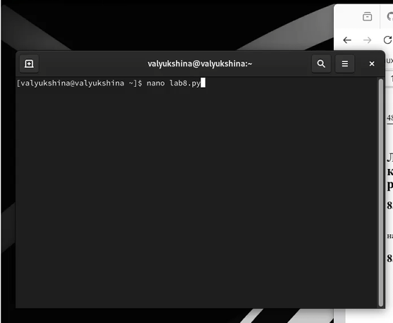
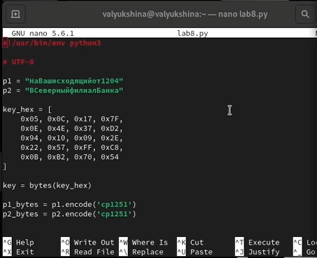
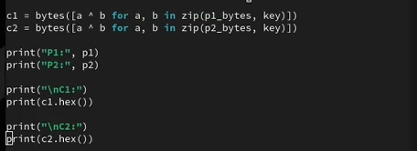
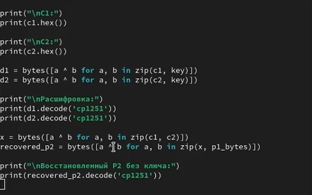
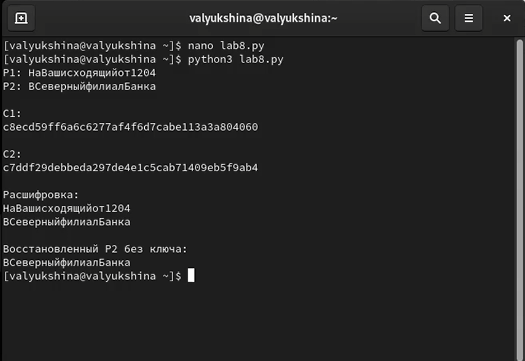

---
## Author
author:
  name: Люкшина Влада Алексеевна
  degrees: студент
  orcid: 0000-0002-0877-7063
  email: 1132243022@rudn.ru
  affiliation:
    - name: Российский университет дружбы народов
      country: Российская Федерация
      postal-code: 117198
      city: Москва
      address: ул. Миклухо-Маклая, д. 6

## Title
title: "Лабораторная работа № 8"
subtitle: "Элементы криптографии. Шифрование (кодирование) различных исходных текстов одним ключом"
license: "CC BY"
---

# Цель работы

Освоить на практике применение режима однократного гаммирования на примере кодирования различных исходных текстов одним ключом.

# Задание

Два текста кодируются одним ключом (однократное гаммирование). Требуется не зная ключа и не стремясь его определить, прочитать оба текста. Необходимо разработать приложение, позволяющее шифровать и дешифровать тексты P1 и P2 в режиме однократного гаммирования. Приложение должно определить вид шифротекстов C1 и C2 обоих текстов P1 и P2 при известном ключе ; Необходимо определить и выразить аналитически способ, при котором злоумышленник может прочитать оба текста, не зная ключа и не стремясь его определить.

# Выполнение лабораторной работы

Создаем файл, где и будем писать программу.([рис. @fig-001])

{#fig-001 width=70%}

Пишем программу.([рис. @fig-002])

{#fig-002 width=70%}

Продолжение кода.([рис. @fig-003])

{#fig-003 width=70%}

Продолжение кода.([рис. @fig-004])

{#fig-004 width=70%}

Запускаем программу([рис. @fig-005])

{#fig-005 width=70%}

# Выводы

В ходе выполнения лабораторной работы №8 мы выяснили, что повторное использование одного и того же ключа в режиме однократного гаммирования приводит к компрометации сообщений. Зная один открытый текст и два шифротекста, можно восстановить второй текст без определения ключа.
::: {#refs}
:::
