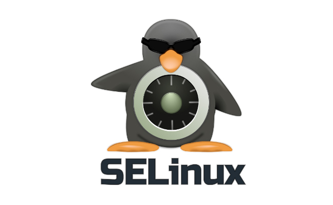
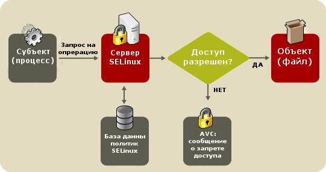

---
## Author
author:
  name: Люкшина Влада
  degrees: student
  email: 1132243022@rudn.ru
  affiliation:
    - name: Российский университет дружбы народов
      country: Российская Федерация
      city: Москва

## Title
title: Механизм безопасности SELinux
subtitle: Архитектура и принципы работы
license: CC BY
date: today

---

# SELinux

## Механизм безопасности Linux

- контроль доступа на уровне системы  
- защита процессов и ресурсов  
- используется в серверных ОС  

# Почему это важно?

## Проблема безопасности

- рост числа кибератак  
- сложные методы взлома  
- компрометация аккаунтов  
- необходимость защиты данных  

# В чём проблема Linux?

## Стандартная модель (DAC)

- доступ задаёт владелец  
- нет централизованного контроля  
- процессы имеют лишние права  

> При взломе — полный доступ  

# Решение
## SELinux

> SELinux

{#fig-001 width=70%}

## SELinux

- встроен в ядро Linux  
- разработан NSA  
- реализует модель MAC  

> система контролирует доступ, а не пользователь  

# Ключевая идея

## Основной принцип

> Запрещено всё, что не разрешено

- строгие политики  
- контроль каждого действия  
- минимальные привилегии  

# Сравнение моделей

## DAC vs MAC

| | DAC | MAC |
|--|-----|-----|
| Кто управляет | пользователь | система |
| Безопасность | низкая | высокая |
| Контроль | слабый | строгий |

SELinux использует MAC  

# Архитектура

## Компоненты SELinux

- ядро Linux  
- Security Server  
- Policy Engine  
- Access Vector Cache  

# Как работает SELinux

## Логика работы

Процесс → Ядро → Проверка политики → Решение → Доступ  

- каждое действие проверяется  
- решение может кэшироваться  
- ускорение через AVC  

## Логика работы

{#fig-001 width=70%}

# Контексты безопасности

## Основа системы

Формат:
user:role:type:level  

- применяется к файлам и процессам  
- определяет права доступа  

# Контексты (пример)

## Разбор

system_u:system_r:httpd_t:s0  

- user — пользователь  
- role — роль  
- type — **главный элемент**  

> именно type управляет доступом  

# Основной механизм

## Type Enforcement

- контроль через типы  
- политика определяет доступ  
- процессы изолированы  

Пример:
allow httpd_t var_log_t:file read;  

# Дополнительно

## RBAC и MLS

**RBAC**
- управление ролями  
- доступ через роли  

**MLS**
- уровни безопасности  
- используется в защищённых системах  

# Режимы работы

## Состояния SELinux

- Enforcing — блокирует  
- Permissive — логирует  
- Disabled — отключён  

> Основной режим: Enforcing  

# Политики

## Типы

- Targeted — защита сервисов  
- Strict — контроль всей системы  
- MLS — уровни безопасности  

> чаще используется Targeted  

# Практика

## Основные команды

- setenforce 1 — включить  
- setenforce 0 — режим логирования  
- ls -Z — контексты файлов  
- ps -Z — контексты процессов  

# Логи

## Где искать ошибки

/var/log/audit/audit.log  

- фиксирует нарушения  
- используется для анализа  
- помогает в настройке  

# Преимущества

## Почему используют SELinux

- высокий уровень защиты  
- контроль процессов  
- защита от атак  
- гибкость политик  

# Недостатки

## Ограничения

- сложность настройки  
- требует знаний  
- возможны ошибки  
- сложен для новичков  

# Вывод

## Результаты

- SELinux усиливает безопасность Linux  
- реализует строгий контроль доступа  
- защищает от многих атак  

# Итог

## Главная мысль

> SELinux — это система, которая контролирует всё

- делает систему безопаснее  
- используется в серверных средах  
- необходим при высоких требованиях  
