---
## Author
author:
  name: Люкшина Влада Алексеевна
  degrees: student
  orcid: 0000-0002-0877-7063
  email: 1132243022@rudn.ru
  affiliation:
    - name: Российский университет дружбы народов
      country: Российская Федерация
      postal-code: 117198
      city: Москва
      address: ул. Миклухо-Маклая, д. 6
## Title
title: Индивидуальный проект
subtitle: Этап 1
license: CC BY
date: today
date-format: "YYYY-MM-DD" # Example: 2025-09-06
---

# Информация

## Докладчик

:::::::::::::: {.columns align=center}
::: {.column width="70%"}

  * Люкшина Влада Алексеевна
  * студент 2 курса
  * Российский университет дружбы народов им. П. Лумумбы

:::
::::::::::::::

# Цель работы
## Цель работы

- Установить дистрибутив Kali Linux в виртуальную машину для дальннейшей работы с уязвимостями веб приложений.

# Задание
## Задание

- Установить дистрибутив Kali Linux в виртуальную машину.

# Выполнение лабораторной работы
## Скачивание

- Скачиваем образ с официального сайта Kali Linux ([рис. @fig-001]).

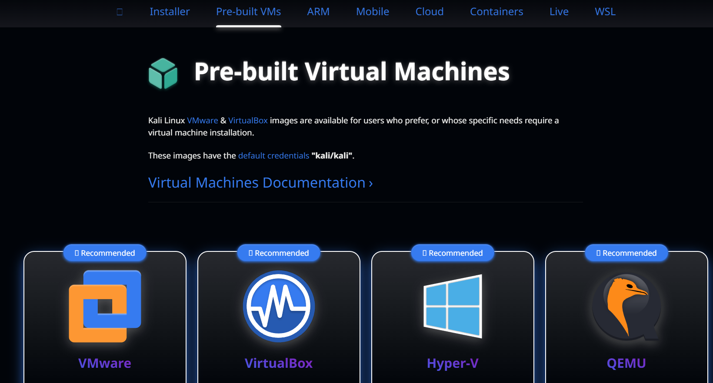{#fig-001 width=70%}

## Создание

- Заходим в VB и создаем новую виртуальную машину со скачанным образом ([рис. @fig-002]).

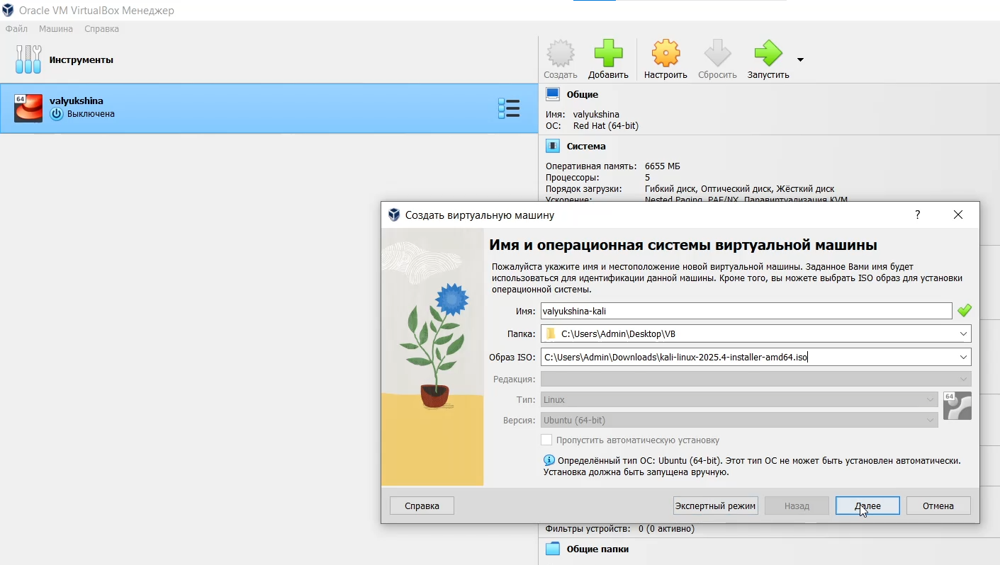{#fig-002 width=70%}

## Память и процессоры

- Выделяем основную память и процессоры ([рис. @fig-003]).

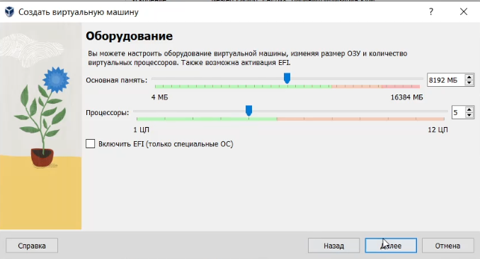{#fig-003 width=70%}

## Диск

- Создаем новый вирутальный диск размером 25гб ([рис. @fig-004]).

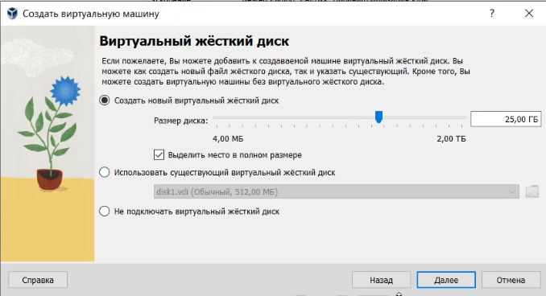{#fig-004 width=70%}

## Создание и запуск

- Создаем вирутальную машину и запускаем ее ([рис. @fig-005]).

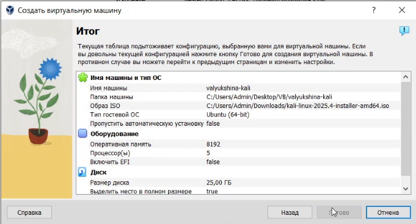{#fig-005 width=70%}

## Установка

- Приступаем к установке ([рис. @fig-006]).

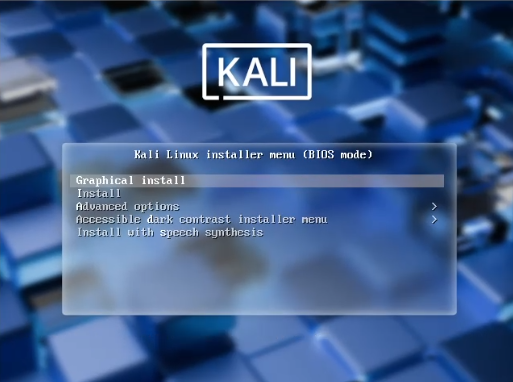{#fig-006 width=70%}

## Настройка клавиатуры

- Настраиваем язык и клавиатуру ([рис. @fig-007]).

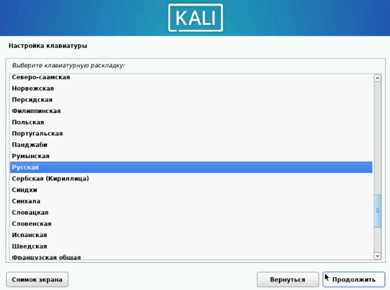{#fig-007 width=70%}

## Имя компьютера

- Вводим имя компьютера ([рис. @fig-008]).

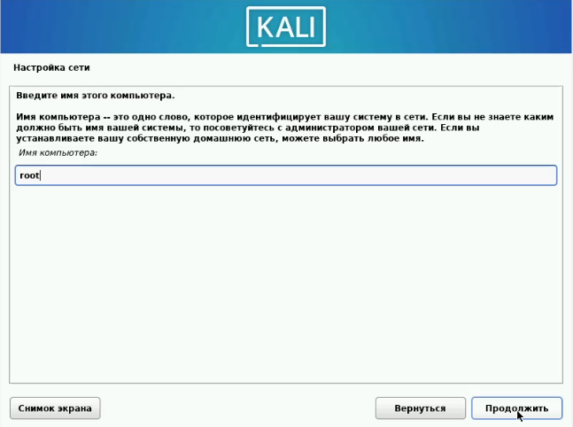{#fig-008 width=70%}

## Домен

- Настраиваем домен ([рис. @fig-009]).

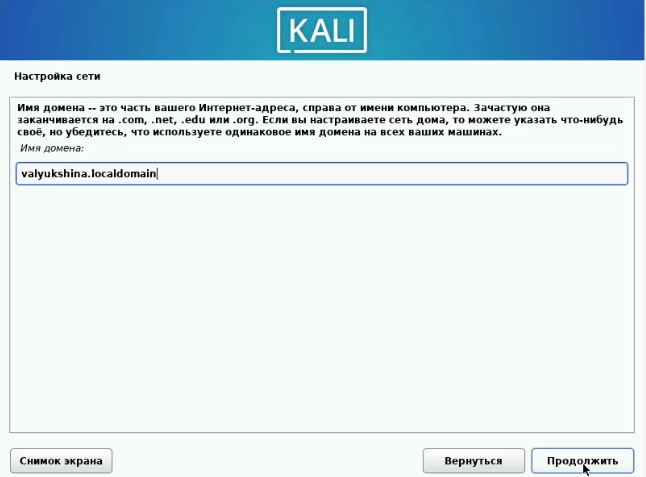{#fig-009 width=70%}

## Имя 

- Задаем имя учетной записи ([рис. @fig-010]).

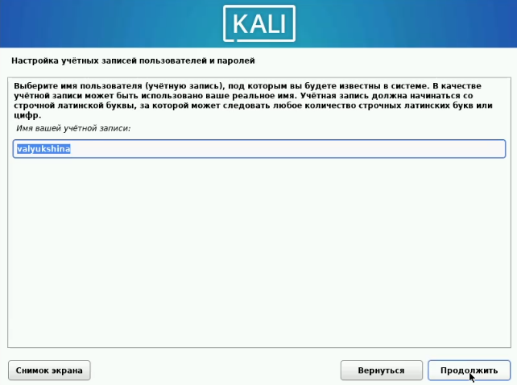{#fig-010 width=70%}

## Пароль

- Задаем пароль ([рис. @fig-011]).

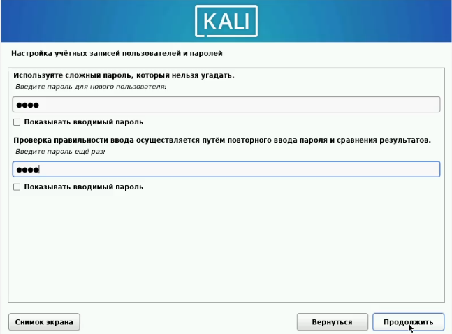{#fig-011 width=70%}

## Время

- Настраиваем время ([рис. @fig-012]).

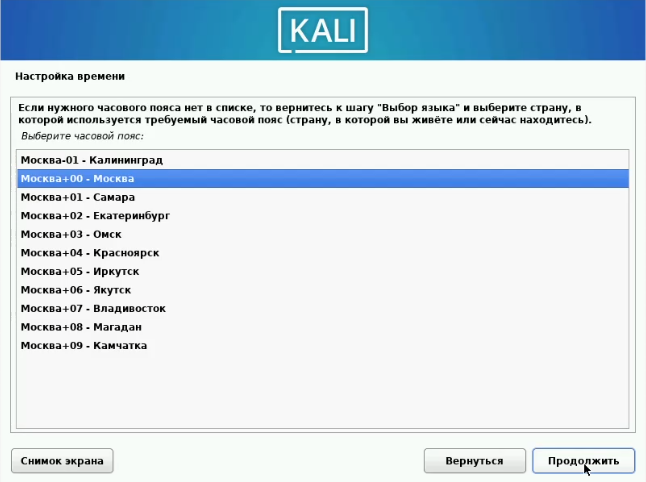{#fig-012 width=70%}

## Диски

- Размечаем диски ([рис. @fig-013]).

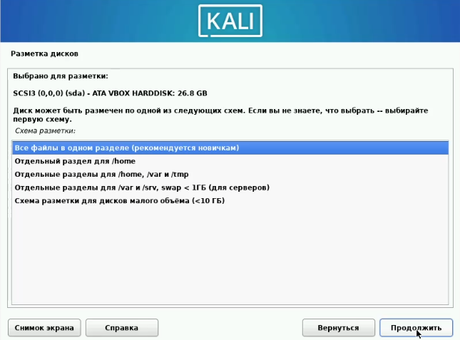{#fig-013 width=70%}

## ПО

- Выбираем программное обеспечение ([рис. @fig-014]).

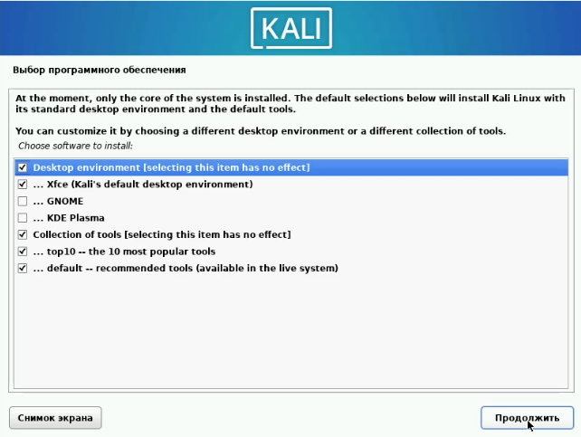{#fig-014 width=70%}

## Перезагрузка

- Перезагружаем виртуальную машину и входим под своим логином и паролем ([рис. @fig-015]).

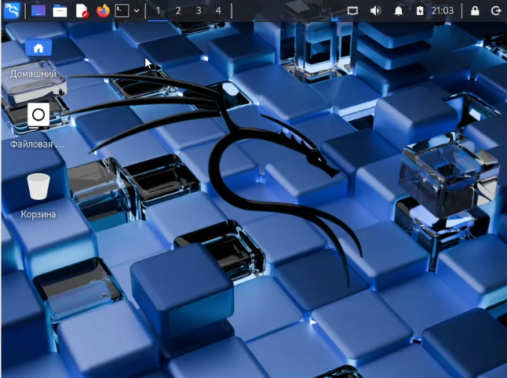{#fig-015 width=70%}

# Выводы

- В ходе выполнения 1 этапа индивидуального проекта мы установили дистрибутив Kali Linux в виртуальную машину.

