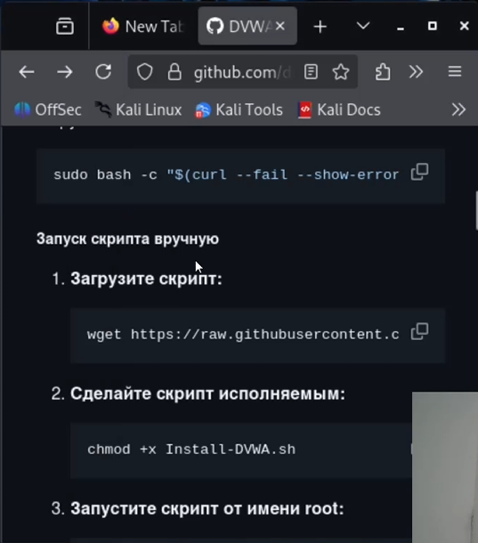
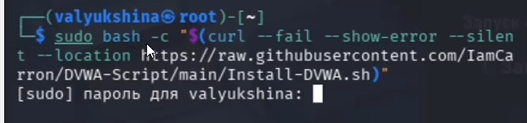
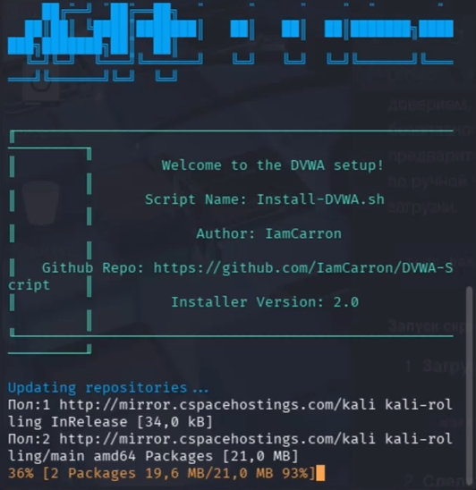
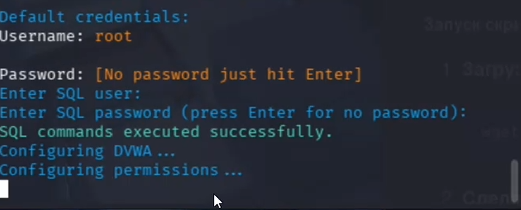

---
## Author
author:
  name: Люкшина Влада Алексеевна
  degrees: студент
  orcid: 0000-0002-0877-7063
  email: 1132243022@rudn.ru
  affiliation:
    - name: Российский университет дружбы народов
      country: Российская Федерация
      postal-code: 117198
      city: Москва
      address: ул. Миклухо-Маклая, д. 6

## Title
title: "Индивидуальный проект"
subtitle: "Этап 2"
license: "CC BY"
---

# Цель работы

Установить DVWA в виртуальную машину для дальнейшей работы с уязвимостями веб приложений.

# Задание

Установить DVWA в виртуальную машину.

# Выполнение лабораторной работы

Переходим на сайт репозитория DVWA([рис. @fig-001]).

{#fig-001 width=70%}

Устанавливаем необходимые пакеты с помощью предложенной в репозитории команды([рис. @fig-002]).

{#fig-002 width=70%}

Установка ([рис. @fig-003]).

{#fig-003 width=70%}

Устанавливаем аккаунт([рис. @fig-004]).

{#fig-004 width=70%}

# Выводы

В ходе выполнения 2 этапа индивидуального проекта мы установили DVWA в виртуальную машину.

::: {#refs}
:::
